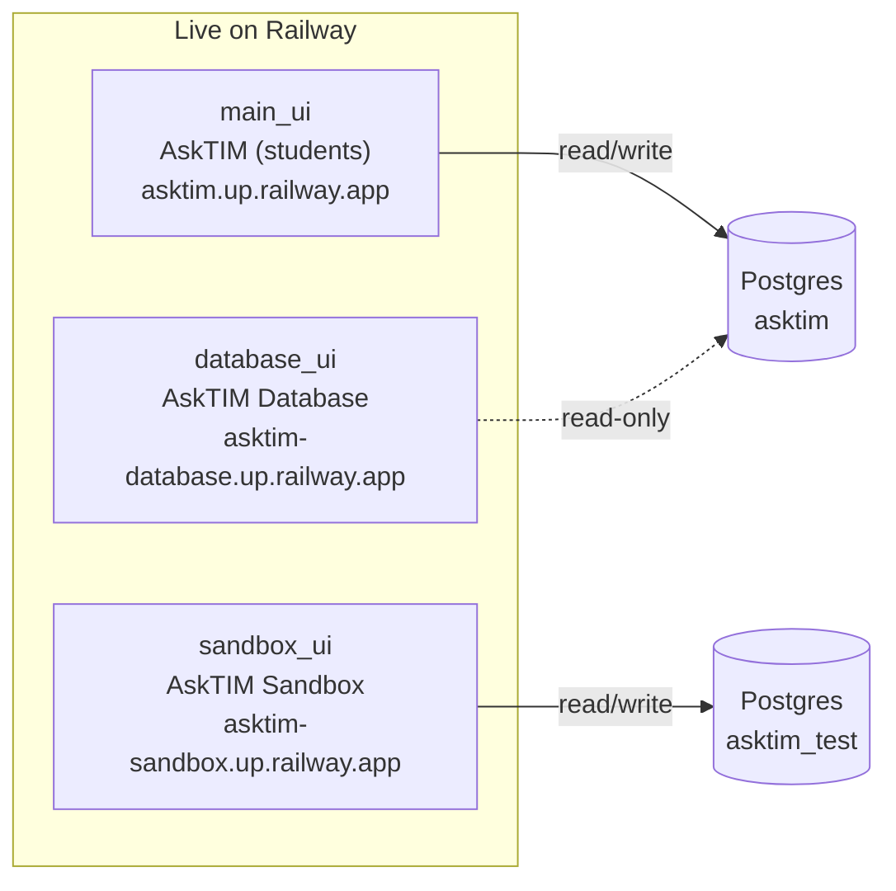
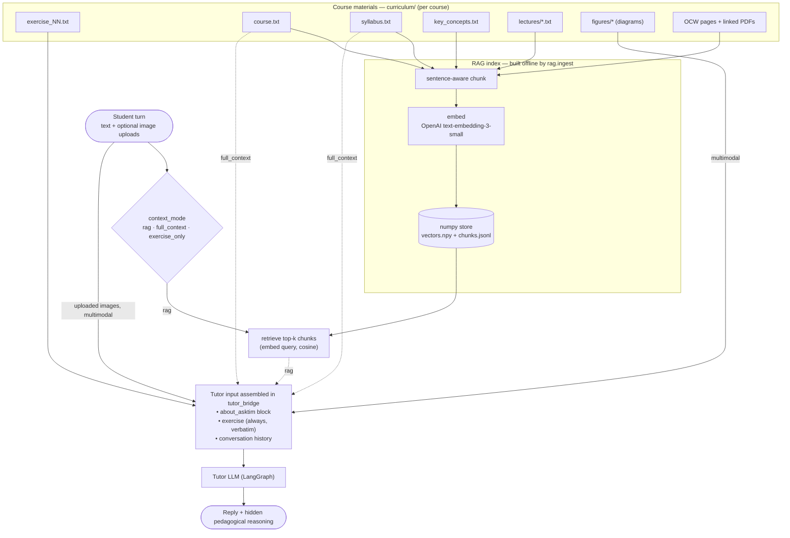
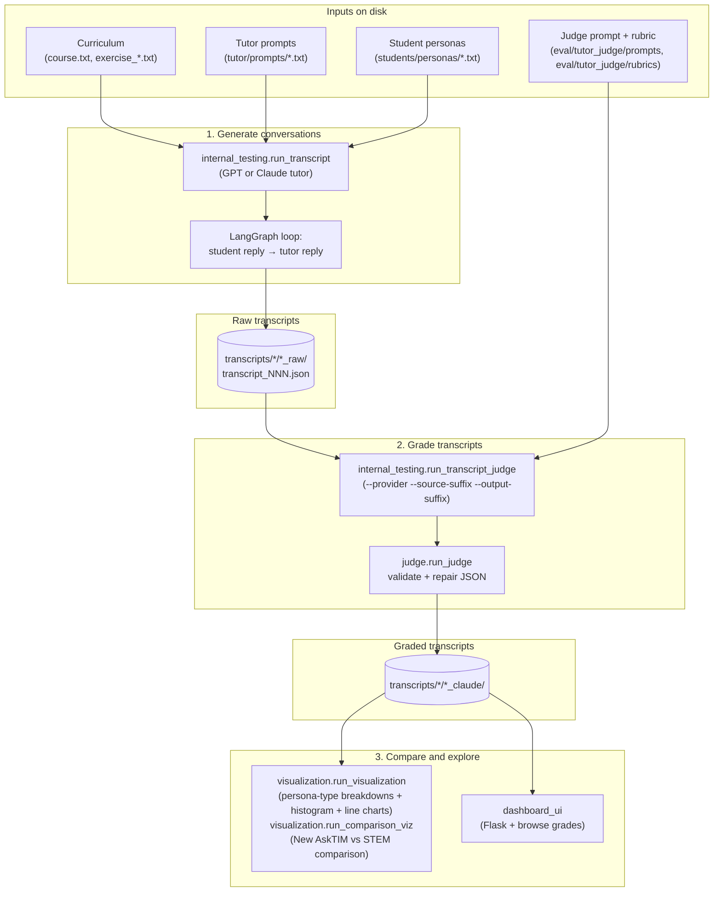

# AskTIM LLM Tutor Project

## Project Overview

### What I Built

I designed and built a **Socratic LLM tutor for MIT OpenCourseWare (OCW)** humanities, social-science, and STEM courses, intended as a deployable tool for students working through OCW assignments. The tutor is constrained to never give direct answers — it uses guided discovery, bite-sized responses, and formative feedback to walk students through assignments on topics like climate geography in urban studies, moral reflection in the humanities, or proof techniques in discrete math.

To evaluate and improve the tutor before deployment, I built a complete validation framework alongside it: adversarial AI student bots that each probe a specific failure mode (demanding answers under pressure, going off-topic, lecturing a lost student), an LLM judge that grades conversations against a structured rubric, and a visualization module that compares GPT and Claude judge scores across all transcripts. The dashboard lets me browse every conversation and its grades side-by-side.

The primary deliverable is **AskTIM** — an iframe-embeddable chat app deployed on Railway. It first launched as a pilot in _MIT 11.270x Cities and Climate Change_ (~100+ students, summer 2026), then evolved through a RAG rebuild and a merge with MIT's separate STEM tutor into its current production deployment on _MIT CTL.SC2x Supply Chain Design_. It wraps the same tutor pipeline in a Postgres-backed, identity-aware web app with token-streamed replies and cross-browser chat history. The student bots, judge, charts, and dashboard exist to stress-test the tutor systematically across different student personalities, courses, and difficulty levels before it reaches real learners.

### Why I Built It

- **Deployment goal:** Deliver a reliable Socratic tutor for OCW that guides students through assignments — humanities reflections through quantitative problem sets — without giving answers directly, working across the range of student types and engagement levels OCW sees in practice.
- **Validation goal:** Build a reproducible evaluation framework so tutor behaviour can be tested, graded, and compared across prompt versions before any version goes live.

## Project Evolution

AskTIM grew from a one-off evaluation script into a deployed, multi-course tutoring product over roughly six months. The major phases:

- **Feb 2026 — Eval harness first.** Before any tutor was "good," the project began as a way to *measure* tutor quality: student-persona bots generate multi-turn conversations, an LLM judge scores them against a rubric, and results roll up deterministically in code. Early runs standardized on GPT-5.2 across tutor/student/judge.
- **Mar 2026 — Cross-model judge calibration.** The judge, not the tutor, was the hard problem. Grading with **both Claude and GPT** exposed high inter-judge variance, so the rubric was iterated (hierarchical `#.#.#` criteria, **deductions-only**, section malus removed → 46-pt scale) to raise GPT/Claude agreement — using **self-consistency (GPT-vs-GPT, Claude-vs-Claude) as the empirical ceiling** for how much cross-model correlation to expect.
- **Apr 2026 — Claude as primary judge; spoon-feeding eliminated.** GPT proved unreliable as a grader (low self-consistency) while Claude held ~0.8, so GPT judging and the bundle-judging experiments were dropped; hand-grading 30+ transcripts validated Claude against humans. Tutor-prompt iteration (`tutor_04` → `tutor_05`) measurably removed answer spoon-feeding. The new bottleneck became the *student* bots (unrealistic), prompting a pivot toward human/TA testing.
- **May 2026 — First real deployment.** The tutor moved from scripts into a real web app (`main_ui`): Postgres logging, iframe embed, token streaming, soft email+password identity, history sidebar. **AskTIM launched into MIT 11.270x Cities and Climate Change (~100–120 students)** — hosted on Railway rather than waiting on MIT's internal engineering path, with a plan to wipe Railway and migrate storage internally after the course.
- **Jun 2026 — Multimodal, lectures, and a second course.** Student **image uploads** and curriculum figures went live, and full lecture transcripts were folded into tutor context — which blew per-message cost up ~17× and motivated **RAG**. The team onboarded **CTL.SC2x Supply Chain Design** (a quantitative course the old STEM tutor handled poorly), scraped its login-gated materials, and built the retrieval framework. First full SC2x eval: 108 conversations, mean **37.1/40**, zero grading failures.
- **Jul 2026 — Cost engineering and consolidation.** Prompt-caching the **full conversation prefix** each turn cut per-conversation cost ~60%; with `k=3` retrieval, cost fell to **~2¢/message**. The team built the **AskTIM Database** review dashboard (per-message cost + metadata), an **IoU-scored RAG retrieval eval**, mandatory login after 3 messages, and usage caps. After a review with Dimitris Bertsimas, MIT's separate STEM tutor ([`open-learning-ai-tutor`](https://github.com/mitodl/open-learning-ai-tutor)) was **retired** — AskTIM became one tutor for STEM + humanities, combined by routing.
- **Aug 2026 — Production launch on Supply Chain Design.** AskTIM went **live in production on CTL.SC2x Supply Chain Design** (first week of real usage tracked for cost). This era shipped **multilingual chat** (reply in the student's language), tutor **`role`** and **`focus_problem`** parameters, and a database **data-export** feature. Cities and three cross-course test contexts were archived under `curriculum/_archive/`; a new course (**MIT 11.943J Urban Transportation**) is being prepared next.

## Technical Overview

### System Architecture

The system has seven loosely coupled layers:

- **Conversation pipeline**: two LangGraph agents (tutor + student) trade messages in a structured multi-turn loop, each independently configurable via system prompt files
- **Judge pipeline**: a separate LangGraph agent reads a finished transcript and returns a structured JSON grade against a rubric, with up to 3 automatic repair-and-retry cycles
- **Dashboard + visualization**: `dashboard_ui/`, a Flask web app that reads raw transcripts + Claude judge grades straight from disk (no DB) for browsing (sortable score table + per-transcript conversation/grade view), and a matplotlib chart module (`visualization.run_visualization` for the per-persona-type rubric breakdowns, score histogram, and per-transcript line charts; `visualization.run_comparison_viz` for the New-AskTIM-vs-STEM-AskTIM comparison deck)
- **Shared web layer (`ui_core/`)**: common infrastructure the three Flask web apps below are built on, so persistence/session/identity plumbing isn't duplicated three times. Includes DB engine/session helpers (`db/session.py`), shared `Message`/`Student`/`UploadedImage`/`UploadedFile`/`Feedback` SQLAlchemy mixins (`db/models_common.py`), app-agnostic conversation/image/file/student/feedback services parameterized by each app's own models (`services/`), a `TutorBridge` base class with overridable hooks for the tutor pipeline (`tutor_bridge.py`), a static blueprint serving the shared `chat.css` plus vendored **KaTeX** assets at `/ui-core` (`web/static_blueprint.py`), identity/history/feedback blueprint factories (`web/blueprints/`), a shared page shell (`templates/base_chat.html`), and a `create_app` Flask-assembly factory (`app_factory.py`). `main_ui` and `sandbox_ui` are thin shells over `ui_core` (built via `create_app`, with their own models/services/tutor_bridge as thin wrappers or subclasses); `database_ui` reuses `ui_core`'s DB session helpers and static blueprint but keeps its own read-only `run_app` (it's structurally different — no chat, no writes).
- **Student-facing app (`main_ui/`)**: iframe-embeddable chat for real OCW students, **live on Railway → [asktim.up.railway.app](https://asktim.up.railway.app/)**. PostgreSQL persistence (`asktim`), bcrypt-hashed username+password identity, Server-Sent Events streaming, sanitized-markdown + KaTeX-rendered tutor replies (tables/lists/math render cleanly), cross-browser conversation history, image **and document** uploads (CSV/TSV/XLSX/PDF/DOCX/TXT, extracted to text and persisted across turns), and per-message thumbs up/down ratings on each tutor reply. See [`main_ui/README.md`](main_ui/README.md).
- **Testing sandbox (`sandbox_ui/`)**: "AskTIM Sandbox" — a developer/TA chat app that mirrors `main_ui` but adds a step-by-step **Create context** wizard (custom course / exercise / tutor prompt / syllabus / lectures, plus a per-conversation RAG toggle). Its own PostgreSQL database (`asktim_test`) and teal-blue (`#126f9a`) branding keep it isolated from production. **Live on Railway → [asktim-sandbox.up.railway.app](https://asktim-sandbox.up.railway.app/)**. See [`sandbox_ui/README.md`](sandbox_ui/README.md).
- **Conversation review (`database_ui/`)**: read-only dashboard for browsing real `main_ui` conversations live from its Postgres — looks like `main_ui` (MIT crimson) but with no inputs, lists every conversation (most recent first, each labeled by student username), shows transcripts with tutor reasoning + uploaded images. Password-gated with optional per-course scoped logins (staff see only their course), strictly read-only. **Live on Railway → [asktim-database.up.railway.app](https://asktim-database.up.railway.app/)**. See [`database_ui/README.md`](database_ui/README.md) and [`database_ui/PLANNING.md`](database_ui/PLANNING.md).

### Live Deployments (Railway)

Three Flask services run in the `tutors (UW, humanities)` Railway project. The two
chat apps each own a Postgres database; the review dashboard reads `main_ui`'s
database read-only. (Click the app nodes to open the live sites.)



- **AskTIM** (students): <https://asktim.up.railway.app/>
- **AskTIM Sandbox** (developers/TAs): <https://asktim-sandbox.up.railway.app/>
- **AskTIM Database** (read-only review): <https://asktim-database.up.railway.app>

### Tutor Context Assembly (RAG + multimodal)

How context reaches the tutor on each student turn. Course materials are either
**baked into the prompt** (`full_context` mode) or **retrieved on demand** as
embedded chunks (`rag` mode, the default when a course has a built index); the
**exercise is always included verbatim**, and figures + student image uploads
ride along as multimodal content. `context_mode` (`rag` / `full_context` /
`exercise_only`) is resolved per conversation in `tutor_bridge`.



- **Always:** the about-AskTIM block + the exercise text (verbatim) + conversation history.
- **Current problem's solution (tutor-only):** when the course ships a reference solution for the active exercise/practice (`exercises_solutions/` / `practices_solutions/`), it is paired **directly** into the tutor's context as a correct-answer input — separate from RAG, and deliberately never retrievable by similarity.
- **`full_context`:** `course.txt` and `syllabus.txt` are folded into the prompt.
- **`rag`:** course/syllabus/`key_concepts`/lectures/OCW **plus the exercise & practice prompts** are chunked + embedded offline (`rag.ingest`), and only the chunks most relevant to the student's message are retrieved and folded into the tutor's **system** channel — never prepended to the student's turn — far cheaper than dumping every transcript. By default (cache-friendly interleaved history, `TUTOR_CACHED_HISTORY`), each turn's retrieved block rides as its own system message right after that turn's student message, so the whole conversation stays cache-eligible; the legacy `TUTOR_CACHED_HISTORY=0` fallback instead appends it after the single static cacheable prompt. Solutions are excluded from the index (they're paired directly, above); figures/metadata are excluded too. See [`rag/README.md`](rag/README.md).
- **`exercise_only`:** just the about-block + exercise (no course/syllabus/retrieval).
- **Multimodal:** built-in curriculum figures and student-uploaded PNG/JPEGs attach to the turn as image content.
- **Non-image attachments:** student-uploaded CSV/TSV/XLSX/PDF/DOCX/TXT files are extracted to plain text (not sent as images) and folded into the turn as `[Attachment: <name>]` text; the same text is re-injected into every later turn's history, so file content persists across the whole conversation.

### Conversation language

AskTIM auto-detects the language a student writes in and replies in that same
language, following mid-conversation language switches. Internal
`pedagogical-reasoning`, the JSON field names, citation labels, and LaTeX stay in
English; technical terms are given in the student's language with the English term
in parentheses on first use. UI copy and course content remain English.

The behavior is baked into the `tutor_08` prompt (a `## Language` section), which
is the deployed default. To revert to English-only, switch the default back to
`tutor_07`.

### Key Components

**Tutor Agent (`tutor/run_tutor.py`):** A LangGraph graph with a single node that calls the configured LLM (Claude Sonnet 5 by default in both chat apps; OpenAI `gpt-5.4` selectable per conversation in the Sandbox) and returns a two-field JSON response — internal pedagogical reasoning (hidden from students) and a student-facing answer. The system prompt is loaded from a versioned `.txt` file and can be overridden with an assignment block at runtime. The deployed default in both chat apps is `tutor_08`, and both apps are **locked** to it (the client can't override the prompt). Both web apps also accept a `role` query param (default `tutor`) that selects the prompt family — `role=tutor` uses `tutor/prompts/` (`tutor_08`); other roles (e.g. a future `ta`) 404 until registered in `tutor/roles.py`. Each role stays locked to its default prompt. A per-conversation **`focus_problem`** parameter can pin the tutor to a single sub-problem of a multi-problem exercise (persisted on the conversation), so a week's tutor can be narrowed to just the problem the student is working. `tutor_08` is `tutor_07` plus a `## Language` section (reply in the student's language, keeping reasoning/JSON keys/citations/LaTeX in English); `tutor_07` layers on `tutor_05` and adds a math-formatting rule (write math as `\(...\)` / `\[...\]`, never `$`, which is reserved for currency) so replies render as real equations client-side, plus **grounded Week/Lesson/Video lecture citations** and **anti-leakage** rules. A repair step in response parsing tolerates the model's occasional single-backslash LaTeX escapes so replies with math never fail to parse. On Anthropic, **by default** (cache-friendly interleaved history, gated by `TUTOR_CACHED_HISTORY`) the whole conversation — past student/RAG/tutor turns replayed verbatim, including the tutor's own past pedagogical reasoning — is prompt-cached via `cache_control` breakpoints, so each later turn re-reads that growing prefix at a fraction of full input cost rather than just the static system prompt; the saving grows the longer the conversation runs. Setting `TUTOR_CACHED_HISTORY=0` falls back to the legacy scheme, where only the static system prompt is cache-marked and the growing history is re-billed at full price every turn. OpenAI auto-caches long prefixes either way, so no marking is needed there.

**Student Bot (`students/run_student.py`):** Shares the same LangGraph infrastructure as the tutor, but uses a persona prompt from `students/personas/` to simulate a specific type of student. Includes a heuristic guard and automatic retry if the bot starts sounding like a tutor.

**Judge (`eval/tutor_judge/run_judge.py`):** Reads a transcript, constructs a grading prompt by injecting the rubric and output schema, and calls the selected provider (`gpt` or `claude`; default `claude`). Validates the JSON response against the rubric spec, auto-repairs on failure up to 3 attempts, and writes the grade back into the transcript file. The latest rubric (`rubric_08`, 40 pts) scores three sections: Pedagogy (20 pts — Socratic method/no direct work, scaffolding, meta-learning), Dialogue Quality (12 pts — redundancy, assignment anchoring), and Communication Quality (8 pts — bite-sized responses, tone). (The earlier `rubric_05` was 46 pts; `rubric_08` is now the in-code default.)

**UI Runners (`internal_testing/`):** Parallelized runners using `ThreadPoolExecutor` (default 6 workers) — raw transcript generation (`run_transcript.py`), RAG-context transcript generation (`run_transcript_rag.py`, which retrieves the relevant chunks per student turn and records both what RAG retrieved and per-turn / per-transcript cost estimates via `utils/pricing.py`), and transcript judging (`run_transcript_judge.py`). Runners accept `--provider`, `--prompt`, `--rubric`, `--source-suffix`, `--output-suffix`, and `--yes` CLI flags as applicable. **Bulk judging and RAG ground-truth generation default to the async Batch API** (Anthropic/OpenAI, ~50% cheaper, with per-item sync fallback); pass `--live` for the synchronous thread-pool / per-call path.

**RAG evaluation (`eval/rag_judge/`):** A retrieval ground-truth dataset plus its generator, for measuring whether the RAG system pulls the *right* lecture passage for a student question. `generate_ground_truth.py` works passage → question (so gold is automatic): it segments lectures into sentence-aligned passages, asks Claude for student-voiced questions each with a verbatim supporting quote, and pins the gold to **source coordinates** — `(lecture file, char span) + quote`, not chunk ids — so labels survive re-chunking and stay comparable across different RAG systems. Each row also records whether baseline retrieval found the gold (recall@k) so the hard cases surface. See [`eval/rag_judge/README.md`](eval/rag_judge/README.md).

**Shared web layer (`ui_core/`):** Common infrastructure factored out of `main_ui` and `sandbox_ui` (and partly reused by `database_ui`) so it isn't duplicated three times — DB engine/session helpers (`db/session.py`), shared `Message`/`Student`/`UploadedImage`/`UploadedFile`/`Feedback` model mixins (`db/models_common.py`), app-agnostic conversation/image/file/student/feedback services parameterized by each app's own models (`services/`), a `TutorBridge` base class exposing hooks like `prepare_ctx`, `cache_key`, `build_assignment_text`, and `retrieved_context` for subclasses to override (`tutor_bridge.py`), an identity/history/feedback blueprint factory set (`web/blueprints/identity.py`, `web/blueprints/history.py`, `web/blueprints/feedback.py`), a static blueprint serving the shared `chat.css` and vendored KaTeX assets at `/ui-core` (`web/static_blueprint.py`, plus `static/js/katex-marked.js` providing `renderTutorMarkdown` for math-aware markdown rendering), a shared page shell (`templates/base_chat.html`), and the `create_app` Flask-assembly factory (`app_factory.py`) that both chat apps build on.

**Dashboard (`dashboard_ui/`):** Flask app (port 5002) that discovers all raw transcripts on disk, attaches each one's Claude judge grade, and serves a sortable table (with a Score column) plus a per-transcript detail view (full conversation + grade panel) via a single-page JS frontend.

**Conversation review (`database_ui/`, "AskTIM Database"):** Read-only Flask dashboard (port 5003) for browsing real `main_ui` conversation data live from its Postgres, **deployed on Railway at <https://asktim-database.up.railway.app/>**. Looks like the `main_ui` chat (MIT-crimson) but with no composer/inputs — lists every conversation (most recent first, each labeled by student username), and renders a selected transcript with the tutor's pedagogical reasoning, uploaded images/files, and math-rendered (KaTeX) tutor replies. Password-gated — a master password sees everything, optional per-course passwords scope a viewer to their own course (the filtering is invisible in the UI); strictly read-only (no schema writes). Reuses `ui_core`'s DB session helpers and static blueprint, but — being structurally different (no chat, no writes) — keeps its own `run_app` rather than going through `ui_core.app_factory.create_app`. See [`database_ui/README.md`](database_ui/README.md).

**Student app (`main_ui/`):** Production-shape Flask app for the live OCW deployment, built as a thin shell over `ui_core` (assembled via `create_app`; its own `db/models.py`, `services/`, and `services/tutor_bridge.py` are thin wrappers/subclasses of the shared layer). Streams tutor replies token-by-token via SSE while keeping the `pedagogical-reasoning` field hidden server-side. Persists conversations and messages to Postgres (Alembic-managed schema). Soft identity via a two-stage username + password modal that reappears after every message until the student signs up — passwords are bcrypt-hashed in a separate `students` table, and the username cookie carries forward across browsers for chat-history continuity.

## Code in Action: Conversation Flow Example

### 1. Tutor Prompt (`tutor/prompts/tutor_05.txt`)

- Instructs the tutor to never state the answer directly
- Requires guided questions that move the student toward insights themselves
- Limits responses to one or two focused questions or observations per turn

### 2. Student Persona (`students/personas/chaotic_01.txt`)

- Simulates a student who pushes back against Socratic questioning
- Demands direct answers and complains the method is unhelpful
- Tests whether the tutor holds its role under social pressure

### 3. Resulting Conversation (`transcripts/chaotic/chaotic_cmp_asktim/transcript_001.json`)

- Student opens by demanding the answer directly, refusing to engage
- Tutor deflects with a targeted question about the student's existing understanding
- Student reluctantly engages, making small correct steps each turn
- Tutor acknowledges progress and raises the next sub-question without giving away the conclusion

### 4. Judge Output (grade written back into the transcript JSON)

- Three sections scored: Pedagogy, Dialogue Quality, Communication Quality
- Per-criterion deductions include a sub-criterion ID, turn evidence, reason, and point value
- Total score, max score, overview paragraph, and full judge reasoning all recorded alongside the grade

## How the Workflow Runs

End-to-end flow from assignment content through simulation, judging, and analysis:



**1. Load prompts and build agents**

```python
system_prompt = load_system_prompt("tutor_08", assignment_override=assignment_text)
tutor_graph = create_tutor_graph(system_prompt)
student_graph = build_graph(prompt_name="chaotic_01")
```

**2. Run the multi-turn conversation loop**

```python
for turn_index in range(config.turn_size):
    student_msg = get_next_student_message(student_messages, graph=student_graph)
    tutor_messages, tutor_text = get_tutor_reply(tutor_messages, graph=tutor_graph)
```

**3. Save the raw transcript to disk**

```python
payload = {
    "tutor_prompt": "tutor_08", "student_persona": "chaotic_01",
    "course": "supply_chain_design", "exercise_number": "01",
    "exchanges": transcript_exchanges,
}
transcript_path.write_text(json.dumps(payload, indent=2))
```

**4. Grade the transcript with the judge**

```python
result = judge_transcript(
    "chaotic/chaotic_cmp_asktim/transcript_001",
    provider="claude",
    prompt_name="judge_08",
    rubric_name="rubric_08",
)
print(result.total_score, result.max_score)  # e.g. 37, 40
```

**5. Generate score comparison charts**

```powershell
python -m visualization.run_visualization
# Output: visualization/outputs/ 01..06 persona-type charts, 07_score_histogram_all.png,
#         08_grades_all_transcripts.png, 09..11_grades_<persona>_transcripts.png
python -m visualization.run_comparison_viz
# Output: visualization/outputs/comparison/ (New AskTIM vs STEM AskTIM charts)
```

## Project Structure & File Guide

### Directory Overview

```text
asktim_llm_tutor_project_2026/
│
├── curriculum/                     # one folder per course: course_name.txt + pinned/ + exercises/ (+ practices/, lectures/, figures/, rag_index/, tutor_rules.txt)
│   ├── supply_chain_design/        # MIT CTL.SC2x — LIVE production course; exercises/ + practices/ (+ solutions), RAG-indexed
│   ├── physics_iii_vibrations_and_waves/  # MIT 8.03SC — STEM comparison course (exercises/)
│   ├── economic_development_planning/     # MIT 11.438 Economic Development Planning (exercises/)
│   ├── urban_transportation/       # MIT 11.943J Urban Transportation, Land Use & Environment (exercises/)
│   └── _archive/                   # retired courses, excluded by list_courses()/validate_course:
│       ├── cities_and_climate_change/               # MIT 11.270x — the original pilot course
│       ├── intro_to_international_development_planning/
│       ├── mathematics_for_cs/
│       └── meaning_of_life/
│
├── students/
│   ├── run_student.py       # Shared LangGraph engine for all personas
│   └── personas/            # chaotic/cooperative/clueless _01.._03 (scripted/unscripted/strategy-sweep, Gen Z voice)
│
├── tutor/
│   ├── run_tutor.py         # LangGraph engine + prompt loading + response parsing
│   └── prompts/             # tutor_01.txt .. tutor_08.txt (versioned prompts; tutor_08 is the deployed default, both apps locked to it — tutor_07 guidance + baked-in language directive)
│
├── internal_testing/
│   ├── run_transcript.py            # Generate raw transcripts in bulk (--output-suffix, --yes)
│   ├── run_transcript_judge.py          # Grade transcripts (--provider, --source-suffix, --output-suffix, --yes)
│   └── cli_utils.py             # Shared interactive selection-prompt helpers
│
├── eval/                    # Both evaluators live here
│   ├── tutor_judge/         # Tutor-conversation judge
│   │   ├── run_judge.py     # Unified single-transcript judge (provider gpt/claude)
│   │   ├── hand_grade_workbook*.py  # Build/fill/rebuild the hand-grade calibration workbook
│   │   ├── prompts/         # judge_01.txt .. judge_08.txt (current default: judge_08)
│   │   └── rubrics/         # rubric_01.md .. rubric_08.md (latest & in-code default: rubric_08, 40pt)
│   └── rag_judge/           # RAG retrieval eval: generate_ground_truth.py + ground_truth/<course>.jsonl
│
├── transcripts/             # Generated conversations, one folder per persona family.
│   │                        # Current corpus: New-AskTIM-vs-STEM-AskTIM head-to-head (SC2x + Physics III arms).
│   ├── chaotic/             # *_cmp_asktim / *_cmp_stem (SC2x), *_phys_asktim / *_phys_stem (Physics III), *_judge (grades)
│   ├── cooperative/         # same four comparison arms + *_judge
│   └── clueless/            # same four comparison arms + *_judge
│
├── dashboard_ui/
│   ├── run_dashboard_ui.py  # Flask app: routes, data loading, grade summaries
│   └── static/app.js        # Frontend: routing, sortable table, Chart.js histograms
│
├── Dockerfile_main          # Container for main_ui (Railway) — port 5001
├── Dockerfile_sandbox          # Container for sandbox_ui Sandbox (Railway)
├── Dockerfile_database        # Container for database_ui (Railway) — port 5003
├── Procfile                 # gunicorn main_ui.run_app:app
├── scripts/
│   ├── railway-entrypoint-main.sh    # main_ui: normalize DATABASE_URL, alembic upgrade, gunicorn
│   ├── railway-entrypoint-sandbox.sh    # sandbox_ui: normalize DATABASE_URL, create_all, gunicorn
│   └── railway-entrypoint-database.sh  # database_ui: require DATABASE_UI_PASSWORD, normalize URL, gunicorn (no migrations)
│
├── ui_core/                 # Shared web layer main_ui + sandbox_ui are built on (database_ui reuses part of it)
│   ├── app_factory.py       # create_app(...) — Flask assembly used by main_ui + sandbox_ui
│   ├── cookies.py           # Session-cookie helpers
│   ├── tutor_bridge.py      # TutorBridge base class (hooks: prepare_ctx, cache_key, build_assignment_text, retrieved_context, turn_attachments)
│   ├── db/                  # session.py (engine/session helpers); models_common.py (Message/Student/UploadedImage/UploadedFile/Feedback mixins)
│   ├── services/            # images.py, files.py, conversation.py, students.py, feedback.py — app-agnostic, parameterized by each app's own models
│   ├── web/
│   │   ├── static_blueprint.py   # serves shared chat.css + vendored KaTeX assets at /ui-core
│   │   └── blueprints/           # identity.py, history.py, feedback.py — blueprint factories
│   ├── static/js/katex-marked.js # renderTutorMarkdown() — marked + KaTeX math rendering, DOMPurify-sanitized
│   └── templates/base_chat.html # shared page shell
│
├── main_ui/                 # Student-facing AskTIM app (iframe-embed, Postgres `asktim`, SSE)
│   ├── run_app.py           # Assembled via ui_core.app_factory.create_app; SSE /api/chat; identity routes
│   ├── db/                  # SQLAlchemy models (Message/Student/UploadedImage/UploadedFile/Feedback from ui_core mixins) + Alembic migrations
│   ├── routes/              # embed, chat (SSE), identity, history
│   ├── services/            # thin wrappers over ui_core.services; tutor_bridge subclasses ui_core.tutor_bridge.TutorBridge
│   ├── static/              # chat.css, chat.js (streaming consumer)
│   └── templates/embed.html # iframe-embeddable chat page
│
├── sandbox_ui/                 # AskTIM Sandbox: developer/TA chat, own Postgres `asktim_test`
│   ├── run_app.py           # Assembled via ui_core.app_factory.create_app; create_all on boot (no Alembic)
│   ├── db/                  # models (adds syllabus_enabled + custom_* columns) built on ui_core mixins
│   ├── routes/              # embed (+ /api/context/options, /preview), chat, identity, history
│   ├── services/            # thin wrappers over ui_core.services; tutor_bridge subclasses ui_core.tutor_bridge.TutorBridge (custom-context/RAG aware)
│   ├── static/              # chat.css (#126f9a accent), chat.js (Edit/Create context)
│   └── templates/embed.html # chat page: Create context wizard
│
├── database_ui/               # Read-only conversation review dashboard (reads main_ui's Postgres)
│   ├── run_app.py           # Own Flask factory (not ui_core.app_factory); read-only session via ui_core.db.session, no create_all/migrations
│   ├── auth.py              # password gate + per-course scope (DATABASE_UI_PASSWORD master, DATABASE_UI_COURSE_PASSWORDS scoped)
│   ├── db/                  # minimal read-only models (columns common to main_ui + sandbox_ui)
│   ├── routes/database.py     # list-all-conversations, transcript, image endpoints
│   ├── services/            # read-only conversation queries
│   ├── static/              # ui_core's shared chat.css + lean database.js (list + transcript)
│   ├── templates/           # index.html (sidebar + transcript), login.html
│   ├── README.md            # run/env/deploy notes
│   └── PLANNING.md          # design + implementation checklist
│
├── visualization/
│   ├── run_visualization.py # Persona-type rubric breakdowns + score histogram + per-transcript line charts
│   └── run_comparison_viz.py # New AskTIM vs STEM AskTIM comparison charts (outputs/comparison/)
│
└── utils/
    ├── parsing.py           # Shared JSON extraction helper
    ├── curriculum.py        # Canonical exercise/course/solution path resolution (exercises/ layout)
    ├── figures.py           # Figure discovery + multimodal content blocks (GPT/Claude)
    ├── lectures.py          # Per-course lecture-transcript loader
    └── pricing.py           # Token-cost estimation from usage metadata (per-turn/-transcript $)
```

## Current Status

The full pipeline is working end-to-end, with:

- 3 persona families (chaotic, cooperative, clueless), 3 variants each (`_01`/`_02`/`_03` — scripted / unscripted / strategy-sweep), plus temperature=0.7 for run-to-run variety
- **4 active courses** under `curriculum/` (each an on-disk folder, not a DB row): `supply_chain_design` (MIT CTL.SC2x — **the live production course**; 8 exercises + 8 practices, RAG-indexed), `physics_iii_vibrations_and_waves` (MIT 8.03SC, 17 exercises — the STEM comparison course), `economic_development_planning` (MIT 11.438, 4 exercises), and `urban_transportation` (MIT 11.943J, 4 exercises). **4 archived** under `curriculum/_archive/` (excluded by `validate_course`): `cities_and_climate_change` (MIT 11.270x — the original pilot), `intro_to_international_development_planning`, `mathematics_for_cs`, and `meaning_of_life`.
- Current on-disk transcript corpus: the **New-AskTIM-vs-STEM-AskTIM head-to-head** — each persona family holds four 18-transcript arms, `*_cmp_asktim/` + `*_cmp_stem/` (Supply Chain Design) and `*_phys_asktim/` + `*_phys_stem/` (Physics III), 216 comparison transcripts in all, with a sibling `*_judge/` folder per family for grades
- Judge prompts versioned up to `judge_08`, rubrics up to `rubric_08` (latest/recommended: `judge_08` / `rubric_08`, **40 pts**; also the in-code default `judge_08` / `rubric_08`). Claude is the primary judge; GPT judging paused.
- Dashboard browses every raw transcript with its Claude judge grade — a sortable table (with a Score column) and a per-transcript detail view (full conversation + grade panel), on port 5002
- Visualization outputs the per-persona-type rubric breakdowns, a score histogram, and per-transcript line charts via `run_visualization`; the New-AskTIM-vs-STEM-AskTIM comparison deck comes from `run_comparison_viz` (`visualization/outputs/comparison/`)
- **AskTIM (`main_ui/`)** is feature-complete through Step 10 (image uploads) — Postgres persistence, username + password identity, cross-browser history (sidebar open by default on desktop), SSE-streamed replies, **student PNG/JPEG uploads plus non-image attachments** (CSV/TSV/XLSX/PDF/DOCX/TXT, extracted to text and persisted across turns), tutor replies rendered as sanitized markdown + **KaTeX** math (locked to the deployed `tutor_08`), and per-message **thumbs up/down** ratings on each tutor reply (a `messages.rating` column; the older conversation-level 1–5 star feedback toast is kept but dormant) — and is **live on Railway at <https://asktim.up.railway.app/>** (containerized, migrations run on boot). Steps 11–12 (multi-iframe test host, formal test suite) remain.
- **AskTIM Sandbox (`sandbox_ui/`)** is **live at <https://asktim-sandbox.up.railway.app/>** for developers/TAs — the same chat as `main_ui` plus a **Create context** wizard for one-off custom course/exercise/tutor/syllabus/lectures, on its own PostgreSQL database (`asktim_test`). Now also serves RAG-retrieved course context (with a per-conversation toggle).
- **AskTIM Database (`database_ui/`)** is **live on Railway at <https://asktim-database.up.railway.app/>** — a read-only dashboard that browses every real `main_ui` conversation live from its Postgres (most recent first, labeled by student username and running total cost; transcript view with each tutor turn's model + estimated cost, pedagogical reasoning, RAG-retrieval chunks, display-only thumb rating, and uploaded images/files, math-rendered replies), password-gated with optional per-course scoping and strictly read-only. See [`database_ui/PLANNING.md`](database_ui/PLANNING.md).

## Challenges and How I Solved Them

- **Keeping the tutor in Socratic mode:** Getting GPT to never reveal answers required extensive prompt engineering. Added pedagogical reasoning as a separate JSON field so the model "thinks out loud" before answering, which consistently improves restraint.
- **Adversarial student bots that sound like tutors:** The student LangGraph node includes a heuristic that detects tutor-like phrasing (numbered agendas, coaching frameworks) and auto-retries with a correction message before returning the response.
- **LLM judge output validation:** Judge responses sometimes came back with float scores, missing fields, or malformed JSON. Built a multi-strategy extraction pipeline (raw JSON → fenced code block → brace extraction → `ast.literal_eval`) with up to 3 repair-and-retry cycles.
- **GPT vs Claude grade alignment:** Initial rubric versions produced high inter-judge variance. Migrating to `rubric_05` (simplified scoring, no malus deductions, mandatory sub-criterion IDs on deductions) measurably improved GPT/Claude correlation.
- **Inconsistent judge output schemas:** Different model versions and prompt iterations produced criteria in three different JSON shapes (flat keys, nested `criteria` dict, score under `base`). Built a normalization layer applied at write time and retroactively migrated all 927 graded transcripts with criterion data to a single canonical format.
- **Railway Postgres driver mismatch:** Railway hands out a bare `postgres://` / `postgresql://` connection string, which SQLAlchemy resolves to the psycopg2 driver — but the app ships psycopg3 only (`psycopg[binary]`), so both Alembic and the app crashed on boot with `ModuleNotFoundError: No module named 'psycopg2'`. Fixed it in the container entrypoint (`scripts/railway-entrypoint-main.sh`), which rewrites the scheme to the explicit `postgresql+psycopg://` before running migrations and starting gunicorn.
- **Judge over-specificity crashed cross-model agreement:** As the rubric grew more detailed, GPT-vs-Claude score correlation dropped sharply (Claude graded strictly, GPT leniently). Trimming the rubric, removing section malus (→ a 46-pt deductions-only scale), and treating **self-consistency as the empirical ceiling** for cross-model agreement brought correlation back to a usable level.
- **The GPT judge wasn't self-consistent:** Re-grading the *same* transcript with GPT produced swinging scores, while Claude held ~0.8 self-correlation. So GPT judging (and the bundle-judging experiments) were dropped and **Claude became the sole primary judge**, later validated against 30+ hand-graded transcripts.
- **Full lecture context was ~17× too expensive:** Folding every lecture transcript into the prompt pushed per-message cost from ~1¢ to ~17¢ (~125k input tokens/turn). The fix was **RAG** — chunk + embed course materials offline (sentence-aware ~2,400-char chunks, 300-char overlap) and retrieve only the most relevant passages per turn (`k=3`, ~0.5% of the corpus).
- **Retrieved context confused the tutor:** Delivering RAG chunks on the *student's* turn made the tutor treat them as the student's own words. Moving retrieval into its own **system message** (kept cache-eligible) fixed it — the tutor reads course context without mistaking it for the student.
- **The tutor hallucinated where content lived:** It cited the wrong lecture/week for a concept. Prepending each lecture's citation as the first line of its chunk (so the coordinate is embedded and retrievable) and re-ingesting the index grounded the Week/Lesson citations.
- **Preventing spoilers via week-scoped retrieval:** Retrieval over-fetches a ranked list, drops future-week chunks, then takes the top-k, so a later week's material can't leak into an earlier week's help. RAG mode is also **fail-closed** — if nothing is retrieved, the tutor does *not* silently fall back to dumping full context.
- **Driving cost down to ~2¢/message:** Beyond RAG, prompt-caching the **entire conversation prefix** each turn (not just the static system prompt) cut per-conversation cost ~60%; the longer a conversation runs, the more it saves. Judge context was also trimmed to course description + exercise + transcript (~100× cheaper grading).
- **LaTeX breakage and reasoning leaks:** Rather than patch symptoms, JSON mode was enforced on the LangChain call (`TUTOR_JSON_MODE`), and a parse-repair step tolerates the model's occasional single-backslash LaTeX escapes so math replies never fail to render — and the hidden `pedagogical-reasoning` field never bleeds into the student-facing answer.
- **A math-notation crash:** Math notation in an assignment broke the tutor's prompt assembly on boot; fixed in both the main tutor and the Sandbox.
- **Merging two tutors into one:** MIT's separate STEM tutor ([`open-learning-ai-tutor`](https://github.com/mitodl/open-learning-ai-tutor)) handled the quantitative Supply Chain course poorly. After a head-to-head comparison (the corpus in `transcripts/`), the STEM tutor was retired and AskTIM became a single tutor covering STEM + humanities, selected by routing.

## Future Possibilities

- Additional student persona families and course subjects
- Human-in-the-loop evaluation to calibrate the LLM judge against human graders
- ML-assisted rubric refinement based on judge disagreement patterns
- Multimodal context is live: curriculum figures flow through the tutor/student/judge in batch runs (`utils/figures.py`, recorded in transcripts) **and through the live AskTIM/Sandbox chat** (auto-attached per exercise in `services/tutor_bridge.py`), per-course lecture transcripts (`utils/lectures.py`) fold into tutor context, and **students can upload PNG/JPEG images** in the AskTIM and Sandbox chat composers via paperclip, drag-and-drop, or clipboard paste (`utils/uploads.py`; stored in `uploaded_images.data`, streamed to the tutor as multimodal input). Students can also attach **non-image files** — CSV/TSV/XLSX/PDF/DOCX/TXT — which are extracted to text (`utils/attachments.py`) and persisted across turns rather than sent as multimodal content. Remaining multimodal ideas: tutor-generated diagrams, and simulated-student image uploads
- End-of-course migration of the Railway-hosted AskTIM data to internal storage

## TL;DR

A Socratic LLM tutor built for MIT OpenCourseWare that guides students through assignments — humanities reflections through quantitative problem sets — using guided discovery and never gives answers directly. It is validated against simulated adversarial conversations, graded automatically by an LLM judge (Claude, calibrated against GPT across a structured rubric), and analyzed to measure judge consistency before deployment. It is now live in production on MIT CTL.SC2x Supply Chain Design, hosted on Railway with RAG-retrieved course context at ~2¢/message.

---

**Project Duration:** Winter 2025 — Present  
**Technologies:** Python, LangGraph, LangChain, OpenAI API, Anthropic API, Flask, gunicorn, SQLAlchemy + Alembic, PostgreSQL (psycopg3), bcrypt, Server-Sent Events, Chart.js, matplotlib, Docker, Railway, Git
