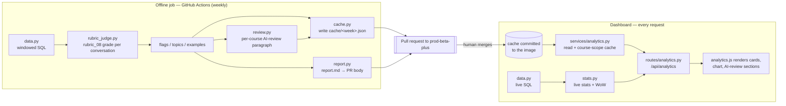

# Weekly Analytics & AI Review

This package builds the AskTIM **weekly report**: a dashboard view that pairs
**live usage stats** with an **AI review** of the week's tutoring conversations.
It has two independent halves, and the split is the most important thing to
understand before reading the code.

| | Live stats | AI review (judged) |
|---|---|---|
| Computed | On every request, from the DB | Offline, once per week, by a scheduled job |
| Source | `services/analytics.py` → SQL | Committed JSON cache in [`cache/`](cache/) |
| Cost | Free (plain queries) | One rubric-grade call per new/changed conversation |
| Freshness | Always current | As of the last generated + merged cache |
| Shown as | Overview cards + daily-activity chart | Per-course "AI review" paragraph + "🚩 Didn't work well" + "🗣 Top topics" |

If a week has no cache file yet, the dashboard still shows live stats and simply
renders **"This week's review is coming soon"** for the AI-review sections. That
is exactly the current state — the [`cache/`](cache/) directory holds only
`.gitkeep`, so no week has been judged yet. Generating and merging the first
cache (see [Setup](#setup-one-time)) is what turns the AI review on.

---

## The pipeline

The judged half is a **producer → cache → consumer** pipeline. The producer runs
offline (GitHub Actions), commits its output as JSON, and a human merges it; the
dashboard only ever *reads* that committed JSON.



**Why a committed cache instead of a database table or live LLM calls?** The
dashboard image is deployed read-only and must render instantly without ever
calling an LLM at request time. Shipping the judged output as a committed file
keeps the dashboard cheap, deterministic, and reviewable — the weekly PR *is* the
human checkpoint before any AI-written summary reaches reviewers.

---

## Moving parts

Each module is pure and independently testable (tests live in [`tests/`](tests/)).

### Producer (offline)

| File | Responsibility |
|---|---|
| [`weeks.py`](weeks.py) | Sun→Sat week math in `America/New_York`. A `Week` exposes its UTC bounds (`start_utc`/`end_utc`) so all SQL stays timezone-portable. `key` is the Sunday ISO date (e.g. `2026-08-09`) and doubles as the cache filename. `previous_complete_week()` is the default target. |
| [`data.py`](data.py) | Windowed, **SELECT-only** read-queries returning plain dataclasses (`ConvRow`, `MsgRow`) — never ORM objects — so the stats layer needs no database. Also `fetch_transcript()` (feeds the judge) and `prior_usernames()` (new vs returning). All queries take `courses: list[str] | None` where `None` = no scope filter. |
| [`judge.py`](judge.py) | The judge **contract**: the `Verdict(worked_well, issues, topics, one_line, grade)` dataclass, the `Judge` protocol, `transcript_hash()` (enables verdict reuse — see [Cost control](#cost-control)), and `FakeJudge`, the deterministic test double so **tests never hit the network**. It no longer ships a live judge — that moved to `rubric_judge.py`. |
| [`rubric_judge.py`](rubric_judge.py) | The **deployed** judge: `RubricJudge` grades each conversation against the mature `rubric_08` 40-point rubric (`eval.tutor_judge.run_judge`) and adapts the rich grade into a `Verdict` — `worked_well` from the 32/40 threshold, `issues` from the rubric deductions (worst-points first), `one_line` from the overview, and the full grade retained in `Verdict.grade`. Topics come from a separate cheap Haiku call. Default model `claude-sonnet-4-6` (pinned: `rubric_08` is calibrated on it and the judge forces `temperature=0`). |
| [`review.py`](review.py) | Writes the short per-course **"AI review" paragraph** shown atop each report — one cheap Haiku call per course (not per conversation) synthesizing the already-judged material (first questions, overviews, topics) into a plain instructor-facing summary. |
| [`stats.py`](stats.py) | Pure aggregation: `compute_stats()` builds usage / ratings / cost / content sections (+ per-course), and `week_over_week()` adds ▲/▼ deltas on the headline metrics (`_HEADLINE`). No LLM, no DB. |
| [`flags.py`](flags.py) | Merges 👎 thumbs-down and judge verdicts into one ranked "didn't work well" list, sorted by severity then source (`both` > `judge` > `thumb`). |
| [`topics.py`](topics.py) | Aggregates each conversation's judge `topics` into ranked per-course lists, carrying up to 3 example first-questions per topic. |
| [`examples.py`](examples.py) | Picks exemplary (worked-well + 👍, most messages), high-engagement (most messages), and a per-course random sample. The sample is **seeded by the week key** so a regenerated cache is byte-identical. |
| [`report.py`](report.py) | Renders the Markdown report (Overview, Didn't-work-well table, Top topics, Meta). Text only — used as both the PR body and the committed `report.md`. |
| [`cache.py`](cache.py) | The producer↔consumer interface. `write_cache()`/`read_cache()` one JSON blob per week under [`cache/`](cache/); `filter_cache()` course-scopes a blob on read; `available_weeks()` lists what's on disk. |
| [`weekly.py`](weekly.py) | The **orchestrator + CLI**. `run_week()` ties every module above together; `main()` is the `python -m database_ui.analytics.weekly` entrypoint the CI job calls. |

### Consumer (dashboard, per request)

| File | Responsibility |
|---|---|
| [`services/analytics.py`](../services/analytics.py) | `live_stats()` computes the always-current stats + WoW for any week; `cached_sections()` reads the committed cache, **strips the internal `_hashes`**, and course-scopes it to the login; `week_options()` / `week_range()` feed the picker. |
| [`routes/analytics.py`](../routes/analytics.py) | The `analytics` blueprint: the scoped JSON API `GET /api/analytics?week=YYYY-MM-DD` and `GET /api/analytics/weeks`. Scope comes from `allowed_courses()`. |
| [`index.html`](../templates/index.html) | The in-dashboard report panel — the report renders in-place on the conversation dashboard (`/`); there is no standalone page. |
| [`static/js/analytics.js`](../static/js/analytics.js) / [`css/analytics.css`](../static/css/analytics.css) | Renders the overview cards (Conversations, Messages, Students, New students, Cost — each with a WoW ▲/▼), the inline-SVG daily-activity chart, the calendar week-picker, and the AI-review sections. Bump the `?v=` query on these assets when you edit them. |

### CI

| File | Responsibility |
|---|---|
| [`../../.github/workflows/weekly-analytics.yml`](../../.github/workflows/weekly-analytics.yml) | Scheduled + manual job that runs the producer and opens the weekly PR. |

---

## What one weekly run does (`run_week`)

1. **Fetch** all conversations whose `started_at` falls in the target week
   (unscoped — the job always judges everything; the dashboard scopes on read),
   plus their messages and the set of prior usernames.
2. **Judge** each conversation against the `rubric_08` rubric. For each, hash the
   transcript; if the hash matches the previous run's and a verdict already
   exists, **reuse it**; otherwise call the judge. The judge sees the
   human-readable course name for domain context, but storage keys off the raw
   `course`.
3. **Aggregate** the verdicts into flags, per-course topics, and example lists,
   and synthesize a per-course AI-review paragraph (`review.py`).
4. **Write** `cache/<week_key>.json` (version, week bounds, `generated_at`,
   `judge_model`, judged conversations, examples, topics) and append an internal
   `_hashes` map for next run's reuse.
5. **Render** live stats + week-over-week, and write a sibling `report.md`
   (also emitted to `--report-out` for the PR body).

Run it manually:

```bash
export DATABASE_UI_DATABASE_URL="postgresql+psycopg://…"   # read access is enough
export ANTHROPIC_API_KEY="sk-ant-…"
export ANALYTICS_JUDGE_MODEL="claude-sonnet-4-6"          # optional; this is the default

python -m database_ui.analytics.weekly                     # previous complete week
python -m database_ui.analytics.weekly --week 2026-08-10   # any date inside a week
python -m database_ui.analytics.weekly --max-convos 5      # cheap smoke test
```

The run is **idempotent and cheap to re-run**: rerunning the same week reuses
every unchanged verdict via the transcript hash, so only new or edited
conversations cost an LLM call.

---

## Cost control

`transcript_hash(pairs)` is a SHA-256 over the ordered `(role, content)` pairs.
`weekly.py` persists a `conv_id → hash` map inside the cache file (`_hashes`) and,
on the next run, reuses the stored `Verdict` whenever the hash is unchanged. This
means a re-run late in a week only pays for conversations that actually changed.
`_hashes` is **stripped by `cached_sections()`** before anything is sent to the
browser, so this bookkeeping never leaves the server.

## Course scoping & privacy

The judged cache is generated **unscoped** (all courses) but is always
course-filtered on read via `filter_cache()` against the login's
`allowed_courses()` — a scoped reviewer never sees another course's flagged
conversations, examples, or topics. Because the committed cache contains real
student usernames/emails, **this repository must stay private.**

---

## The scheduled job & how AI review goes live

[`weekly-analytics.yml`](../../.github/workflows/weekly-analytics.yml) runs:

- **When:** `cron: "0 11 * * 1"` (Mon 11:00 UTC ≈ Sun night ET) and on-demand via
  **workflow_dispatch** (optional `week` and `max_convos` inputs).
- **Against:** `TARGET_BRANCH: prod-beta-plus` (checked out, full history).
- **Steps:** install `requirements.txt` → `python -m database_ui.analytics.weekly`
  → commit `database_ui/analytics/cache/` to a new `analytics/week-<key>` branch →
  `gh pr create` against `prod-beta-plus` with `report.md` as the body.

**Merging that PR is what deploys the AI review** — the committed cache ships in
the next `prod-beta-plus` build and the dashboard immediately renders the judged
sections for that week. Nothing is auto-merged; the PR is the human checkpoint.

---

## Setup (one-time)

The code, the workflow, and the `langchain-anthropic` dependency are already on
`prod-beta-plus`. What remains is GitHub-side configuration — do this once, then
the weekly cadence is automatic.

1. **Add repository secrets** (Settings → Secrets and variables → Actions →
   *Secrets*):
   - `ANALYTICS_DATABASE_URL` — a **read** connection string to the production
     database (the same DB the app reads; a read-only role is ideal).
   - `ANTHROPIC_API_KEY` — key for the judge model.

   Or with the CLI:
   ```bash
   gh secret set ANALYTICS_DATABASE_URL --body "postgresql+psycopg://…"
   gh secret set ANTHROPIC_API_KEY      --body "sk-ant-…"
   ```

2. **(Optional) Override the judge model** (same screen → *Variables*):
   `ANALYTICS_JUDGE_MODEL` (defaults to `claude-sonnet-4-6` when unset — the
   model `rubric_08` is calibrated on; override only if you know what you're
   doing).
   ```bash
   gh variable set ANALYTICS_JUDGE_MODEL --body "claude-sonnet-4-6"
   ```

3. **Allow Actions to open PRs:** Settings → Actions → General → *Workflow
   permissions* → enable **"Allow GitHub Actions to create and approve pull
   requests."** (The workflow already declares `contents: write` /
   `pull-requests: write`; this repo setting is the other half.)

4. **Generate the first cache** — trigger a manual run (a small `max_convos`
   is a good first smoke test):
   ```bash
   gh workflow run "Weekly analytics report" -f max_convos=5
   ```
   or Actions → *Weekly analytics report* → **Run workflow**.

5. **Review & merge the PR** it opens against `prod-beta-plus`. Once merged and
   deployed, the AI-review sections replace "coming soon" for that week.

After that, the Monday cron opens a fresh PR each week; review and merge to
publish.

### Configuration reference

| Name | Where | Required | Purpose |
|---|---|---|---|
| `ANALYTICS_DATABASE_URL` | Actions secret | yes | Read DB URL for the offline job |
| `ANTHROPIC_API_KEY` | Actions secret | yes | Judge model credentials |
| `ANALYTICS_JUDGE_MODEL` | Actions variable | no | Judge model (default `claude-sonnet-4-6`) |
| `DATABASE_UI_DATABASE_URL` | local env | local runs | Read DB URL when running the CLI by hand |
| `GITHUB_TOKEN` | provided | — | Auto-provided to the workflow for the PR |

---

## Testing

```bash
python -m pytest database_ui -q
```

Every module has unit tests; the judge is faked (`FakeJudge`) so the suite never
makes a network call.
