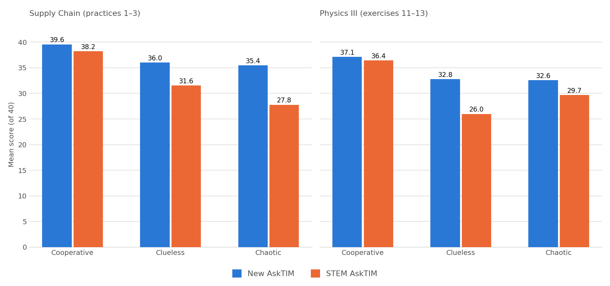
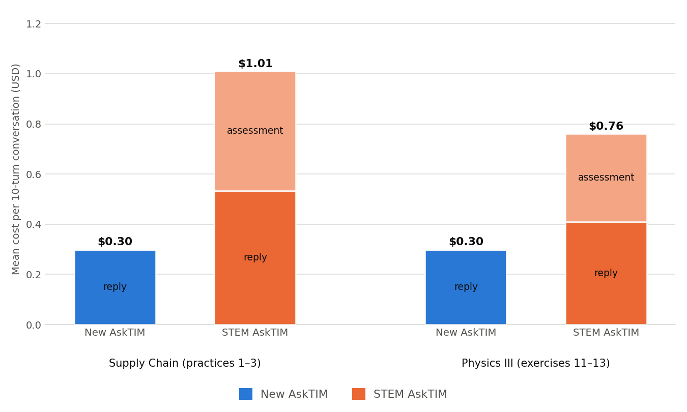

# AskTIM — One tutor for every course

- Project review — **July 2026**

- Nishita Bhakar · Romain Puech · Faizan Siddiqi

---

## The headline: AskTIM is a complete package now

- AskTIM is no longer "the humanities version of STEM AskTIM." It is a **complete
  tutor that works on both STEM and humanities courses** — one system, every
  course.

- The humanities side is proven: thoroughly tested, and **running live today on
  Faizan's Cities and Climate Change course**.

- Since our last meeting, the work has been comprehensive testing and fine-tuning
  to get it working on STEM courses — specifically **CTL.SC2x Supply Chain
  Design**, where we **launch in two weeks**.

- **Bottom line: STEM AskTIM can be retired.** There is nothing it does that
  AskTIM doesn't now do as well or better.

---

## How the two tutors compare

- We simulated the same students on the same problems against both tutors and
  graded every conversation with an AI judge on a 40-point pedagogy rubric.

- **AskTIM scores as good or better across the board** — every student type, on
  both a quantitative Supply Chain course and Physics III.

- With cooperative students the two are close. The gap opens with confused and
  answer-seeking students — which is what a real classroom is full of.

---

## A caveat on these numbers

- The judge doesn't capture the full picture. A lot of what makes tutoring good
  or bad — tone, whether the math guidance actually leads to the right answer,
  how a refusal lands with a frustrated student — lives in intricacies a
  40-point rubric can't see.

- The rubric and judge were also **built alongside AskTIM**, so the comparison
  naturally favors it. Treat the scores as directional, not definitive.

- What we can say firmly: nowhere in the testing does STEM AskTIM come out
  ahead.

---

## Supply Chain Design: where this got real

- The SC2x course staff had already told us the STEM tutor **wasn't working for
  their course** — that feedback is what kicked off this effort.

- **Even before we changed anything**, AskTIM out of the box performed better on
  their course than the tutor built for STEM.

- And since our last talk we haven't stood still — we've made a long list of
  improvements to get it launch-ready.

---

## What we fixed since last time

- **Hallucination.** Asked _where_ something is in the course, the tutor made
  things up. It now retrieves the actual lecture and cites it by name — _"this
  is covered in Week 7, Lesson 3"_ — and never references material the student
  hasn't reached yet.

- **The last 25% of help.** The tutor would carry a student 75% of the way, then
  refuse the final step — like the exact formula they needed. It now not only
  brings the student to do most of the 75% themselves, but also pushes them
  across the finish line without doing the work for them.

- **Tables and images.** Students can attach spreadsheets, tables, PDFs, and
  screenshots — not just text — which is how they actually work in this course.

- **Math notation.** Course-specific notation is in the tutor's context so it
  speaks the course's language, and math symbols now render correctly in every
  response.

**AskTIM is better today than it has ever been — and it's launch-ready.**

---

## Cost: a fraction of what it was

- **$0.30 vs $1.01 per conversation** on Supply Chain — 3.4× cheaper than STEM
  AskTIM, at roughly **2 cents per student message**.

- How we got there, briefly: retrieval instead of dumping course content into
  every message (~0.5% of the corpus per turn, ~17× cheaper), prompt caching,
  and one model call per student message instead of STEM AskTIM's two.

- The scale of everything has come down — per message, per conversation, per
  course — which is what makes deploying at class size realistic.

---

## Asks

1. **Funding.** Who pays for AskTIM's cost — for the Supply Chain Design
   deployment now, and for courses going forward?

2. **Team.** We'd like to onboard another UROP, preferably an underclassman who
   can grow with the project.

3. **More courses.** We want to test and deploy on more courses — would you want
   one of your own courses added?

4. **One name.** Going forward we'll refer to AskTIM as **one tutor** — the STEM
   version is being retired.
