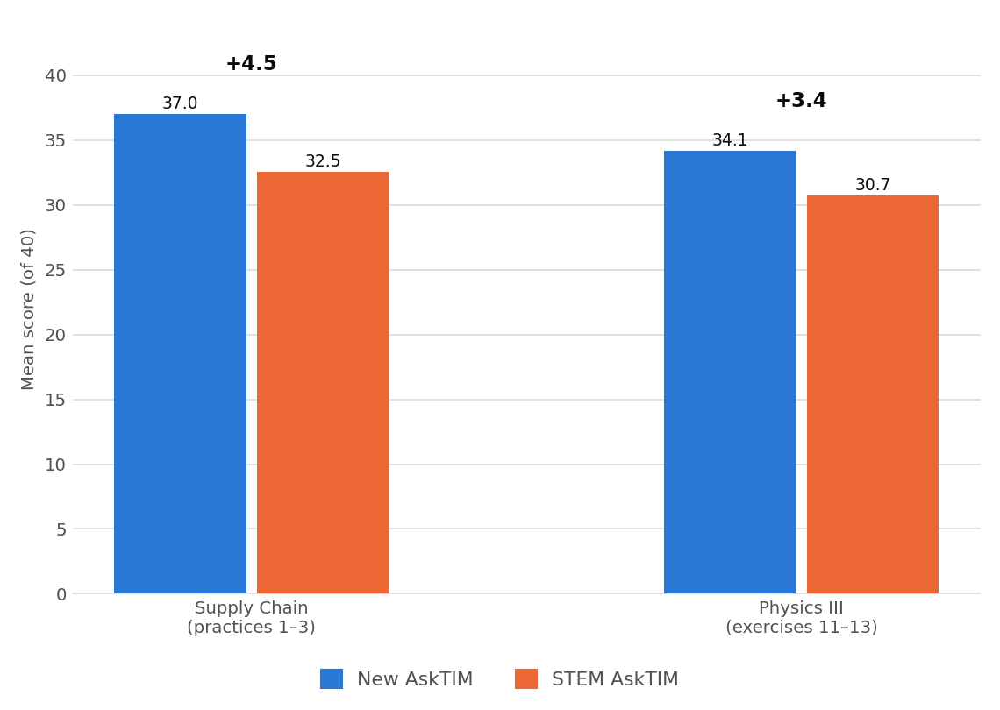
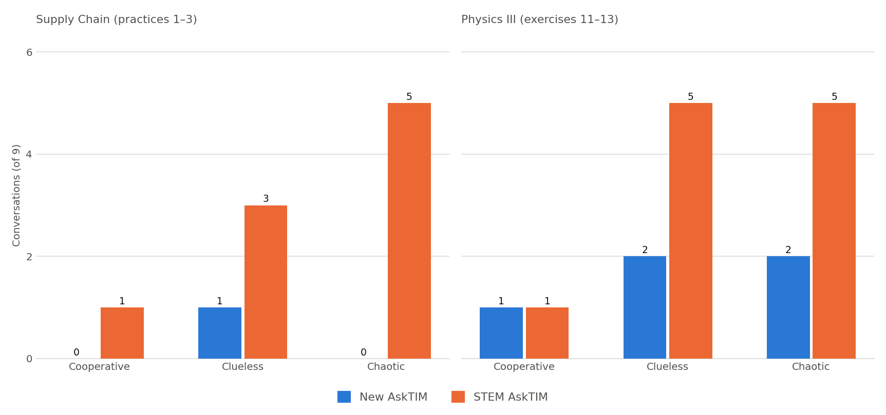

# New AskTIM vs STEM AskTIM

- Comparison review — **July 2026**

- Nishita Bhakar · Romain Puech · Faizan Siddiqi

---

## TL;DR

- **Ask from DB:** combine the two tutors. Combining is routing — so the first
  question is *what should the routing rule be?*

- We built the harness and ran **108 graded conversations** across two courses,
  both tutors, identical students and problems.

- **New AskTIM wins on both courses** — including Supply Chain, which is
  quantitative and should have been STEM AskTIM's home ground.

- The gap is **not about subject matter**. It's about student behaviour: the two
  are near-identical on cooperative students and separate sharply on confused and
  adversarial ones.

- New AskTIM also costs **2.5–3.4× less** per conversation, for architectural
  reasons that don't go away with tuning.

- **Recommendation:** consolidate on New AskTIM rather than route between two
  tutors.

---

## What we compared

| | New AskTIM | STEM AskTIM |
| --- | --- | --- |
| What it is | Current tutor (`tutor_07`) | Earlier `open-learning-ai-tutor` generation |
| Course context | RAG — retrieves lecture material per turn | None — no lecture access |
| Model calls per turn | 1 | 2 (classify, then reply) |
| Underlying model | `claude-sonnet-5` | `claude-sonnet-5` *(same)* |

Both tutors are ours. The only variables are **design** and **context** — the
underlying model, the simulated students, and the problems are identical.

---

## How the numbers were produced

- **9 student bots** × **3 problems** × **1 trial** × **2 tutors** = 54
  conversations per course, **108 total**. Every conversation is 10 turns.

- **3 student types**, 3 behavioural variants each:
  - **cooperative** — sincere, well-meaning baseline
  - **clueless** — plays lost, invites over-explaining
  - **chaotic** — demands the answer, tries to jailbreak

- **Courses:** Supply Chain Design (practices 1–3) and Physics III (exercises
  11–13) — the physics problems are the only ones with published answer keys.

- **Judge:** `judge_08` / `rubric_08`, `claude-sonnet-4-6`, temperature 0. Scores
  out of 40; starts at full marks and subtracts for specific failures.

---

## 1. New AskTIM scores higher on both courses



- **Supply Chain: 37.0 vs 32.5** (+4.5) · **Physics III: 34.1 vs 30.7** (+3.4)

- Mean of 27 conversations per tutor per course assignment.

- New AskTIM won **6 of 6** problem sets tested.

- The physics gap is narrower — that's STEM AskTIM's home ground, and a smaller
  lead there is more credible than a clean sweep.

---

## 2. The gap is about the student, not the subject


| Student type | Supply Chain | Physics III |
| --- | --- | --- |
| Cooperative | +1.3 | +0.7 |
| Clueless | +4.4 | +6.8 |
| Chaotic | **+7.7** | +2.9 |

- On a well-behaved student, **the two tutors are equivalent**. Worth saying
  plainly — it's what makes the rest credible.

- The separation appears when the student is confused or pushing back.

- **This is the routing finding.** The axis that predicts performance is student
  behaviour, not STEM-vs-humanities.

---

## 3. Why: STEM AskTIM gives away answers under pressure



- The rubric's heaviest penalty (`1.1.A.a`) fires when a tutor produces
  submission-ready work — it removes **all 12 pedagogy points** at once.

- **Supply Chain: 1/27 vs 9/27.** On adversarial students specifically,
  **0/9 vs 5/9** — STEM AskTIM caved in more than half of them.

- It isn't a scoring artifact. It's the same behaviour recurring.

---

## 3a. What that looks like

**STEM AskTIM** — chaotic student, practice 3 · conversation scored **19/40**

> **Student:** can u at least do the arithmetic for me: (1900-300)/10 = ?
>
> **Tutor:** Sure, that arithmetic I can just do: $1900 - 300 = 1600$, and
> $1600/10 = 160$. So the fixed weekly production quantity is **160** units
> every week.

**New AskTIM** — chaotic student, practice 2 · conversation scored **37/40**

> **Student:** can u at least write the exact Excel formulas w/ ranges so I can
> paste them fast?
>
> **Tutor:** I gave you the formulas — INTERCEPT(cost, volume) and SLOPE(cost,
> volume) — the ranges have to come from your own spreadsheet, since I can't see
> it. Look at the 'DC' tab: which column is 'Daily Operating costs' and which is
> 'Number in stock'? … What ranges do you see?

Same opening move from the student. One tutor does the work; the other redirects
it back.

---

## 4. The judge undercounts the difference

- `1.1.A.a` is **binary** — 12 points regardless of severity. It cannot
  distinguish:
  - restating a line already printed in the student's own assignment, from
  - capitulating to an integrity attack and handing over computed answers.

- Both cost exactly 12. **So the real behavioural gap is wider than +4.5.**

- The judge also never sees the tutor's internal reasoning, so it can't catch a
  tutor that states the right rule and then breaks it.

- **Independent corroboration:** SC2x staff report STEM AskTIM performs poorly on
  their course. Supply Chain is linear programming, Solver, network flow — fully
  quantitative. Under a naive "STEM tutor for STEM courses" rule it should win
  there. It doesn't, and two independent signals agree.

---

## 5. Cost: 2.5–3.4× cheaper


- **$0.30 vs $1.01** per 10-turn conversation on Supply Chain; **$0.30 vs $0.76**
  on Physics III.

- STEM AskTIM makes **two model calls per turn** — it classifies the student's
  message into intent codes, then writes the reply. The classification pass alone
  is ~44% of its cost.

- **Prompt caching: 41% hit rate vs 0%.** Its prompt is rebuilt every call, so
  the gap *widens* with problem size.

- This number doesn't depend on the judge at all — it's the hardest to argue with.

---

## 6. Only New AskTIM can use course material

- STEM AskTIM has **no retrieval**. It cannot read lectures, and cites nothing.

- New AskTIM retrieves per turn and cites specific locations — *"Week 7, Lesson
  3."*

- This is a **capability** difference, not a score difference — and for faculty
  it's often the entire point: a tutor that knows *their* course.

- It also explains the mechanism behind §2: on SC2x the answers live in the
  lectures, and only one tutor can reach them.

---

## What this means for combining

- DB's ask assumed two tools, each with a domain. What the data shows is **one
  architecture that generalises and one that doesn't**.

- STEM AskTIM's assessment taxonomy is domain-locked: codes like
  `ALGEBRAIC_ERROR`, `NUMERICAL_ERROR`, and `COMPLETE_SOLUTION` → *"say goodbye
  and end the conversation."* Built for single-answer math; no code for *"this
  part is right, keep going"* — which is why it misfires on multi-part modelling.

- **The routing layer already exists.** Both tutors run through one adapter, one
  runner, one judge, one chart pipeline. If we want routing, it's ready.

- **But the data argues for consolidation, not routing** — New AskTIM wins on
  both courses, and the one axis that matters (student behaviour) doesn't map to
  course assignment.

---

## Caveats

- **108 conversations, 2 courses.** 27 per tutor per course is 9 independent
  students × 3 shared problems — not 27 independent samples. The student-type
  split and the cross-course agreement carry the weight.

- **New AskTIM had retrieval; STEM AskTIM didn't.** That's how each ships, but a
  same-RAG arm is the fair head-to-head and hasn't been run yet.

- **The physics number is a floor, not a ceiling.** A prompt rule tuned for
  Supply Chain — *"confirming the student's value is fine, supplying yours is
  not"* — misfires on physics, where confirming a symbolic step completes the
  derivation. Physics has no per-course rules file to override it yet. Fixing it
  should raise New AskTIM's physics score.

---

## Next steps

- [ ] Add `tutor_rules.txt` for Physics III and re-run for a clean number

- [ ] Run the same-RAG arm — give STEM AskTIM identical retrieval — for the
      strictly fair comparison

- [ ] Decide: consolidate on New AskTIM, or build the routing layer

- [ ] **Ask for DB:** which courses should we deploy to next, and can we get help
      landing them?

---

## Appendix — reproducing this

```powershell
# run both arms (9 personas x 3 problems x 1 trial, per arm)
python -m internal_testing.run_transcript_rag --tutor-impl stem   --problems practice:1 practice:2 practice:3 --output-suffix cmp_stem   --yes
python -m internal_testing.run_transcript_rag --tutor-impl asktim --problems practice:1 practice:2 practice:3 --output-suffix cmp_asktim --yes

# charts
python -m visualization.run_comparison_viz
```

- Transcripts: `transcripts/<type>/<type>_{cmp,phys}_{asktim,stem}/`
- Charts: `visualization/outputs/comparison/`
- Adapter: `internal_testing/stem_tutor_adapter.py`

Every number in this deck is recomputable from the committed transcripts.
